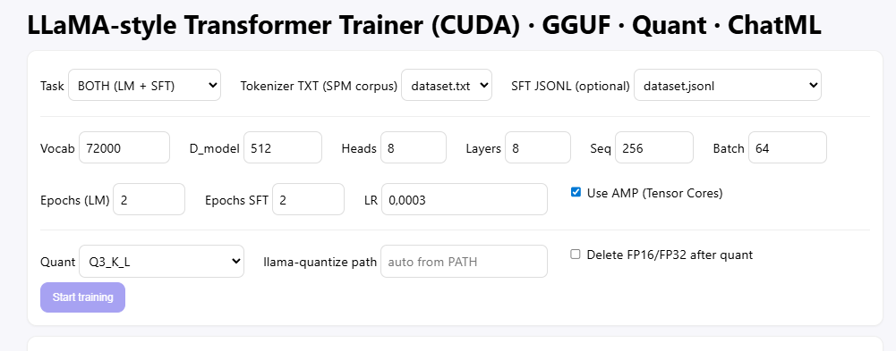
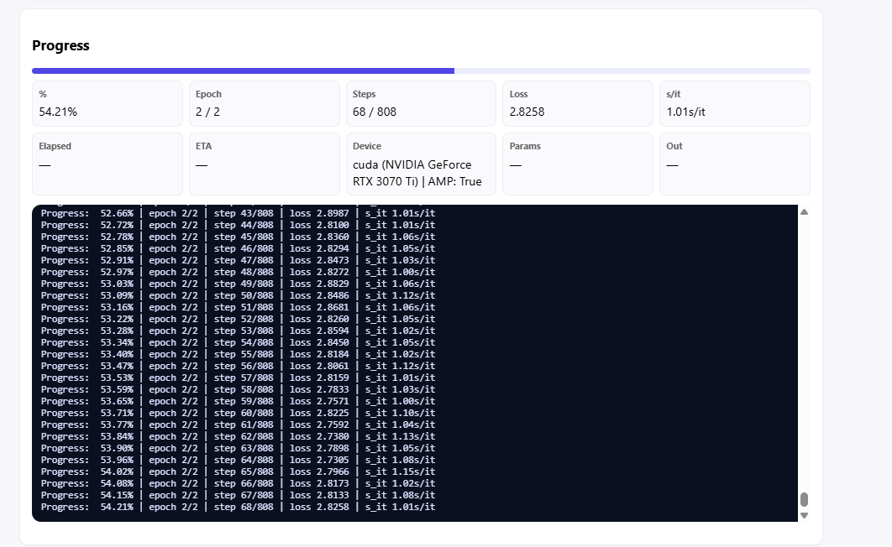

# PyAiModel-GGUF-Llama-Quant

- (ChatML, BOTH default, auto JSONL)
- Train LLaMA-style Transformer (RMSNorm + RoPE + SwiGLU, optional GQA) with SentencePiece (BPE mode)
- and export a fully compliant GGUF v3 using the official `gguf` library.
- Adds SFT with ChatML (<|im_start|>/<|im_end|>) and permissive tokenizer for Unicode/bytes.
- Default task: BOTH (LM + SFT) with auto JSONL discovery in Datasets/.
- Author: Artur Strazewicz — 2025 — MIT